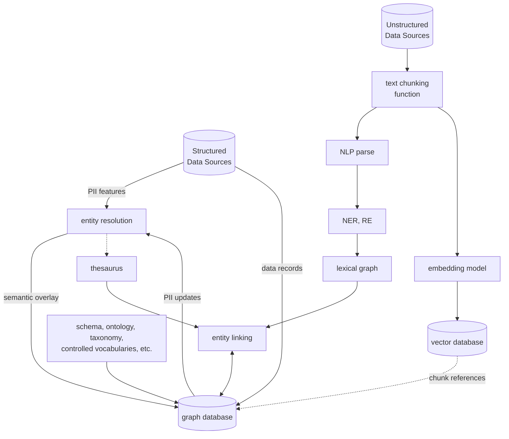
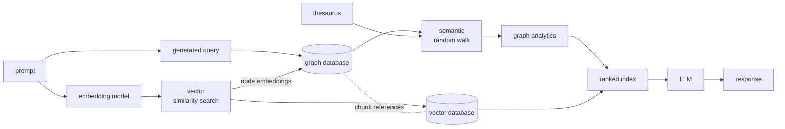

# Unbundling the Graph in GraphRAG

- Author: Paco Nathan
- Date: November 19, 2024
- Source: https://www.oreilly.com/radar/unbundling-the-graph-in-graphrag/

One popular term encountered in generative AI practice is retrieval-augmented generation (RAG). Reasons for using RAG are clear: large language models (LLMs), which are effectively syntax engines, tend to “hallucinate” by inventing answers from pieces of their training data. The haphazard results may be entertaining, although not quite based in fact. RAG provides a way to “ground” answers within a selected set of content. Also, in place of expensive retraining or fine-tuning for an LLM, this approach allows for quick data updates at low cost. See the primary sources [REALM: Retrieval-Augmented Language Model Pre-Training](https://arxiv.org/abs/2002.08909) by Kelvin Guu, et al., at Google, and [Retrieval-Augmented Generation for Knowledge-Intensive NLP Tasks](https://arxiv.org/abs/2005.11401) by Patrick Lewis, et al., at Facebook—both from 2020.

Here’s a simple rough sketch of RAG:

1. Start with a collection of documents about a domain.
2. Split each document into chunks.
3. Run each chunk of text through an embedding model to compute a vector for it.
4. Store these chunks in a vector database, indexed by their embedding vectors.

When a question gets asked, run its text through this same embedding model, determine which chunks are nearest neighbors, then present these chunks as a ranked list to the LLM to generate a response. While the overall process may be more complicated in practice, this is the gist.

The various flavors of RAG borrow from recommender systems practices, such as the use of vector databases and embeddings. Large-scale production recommenders, search engines, and other discovery processes also have a long history of leveraging knowledge graphs, such as at Amazon, Alphabet, Microsoft, LinkedIn, eBay, Pinterest, and so on.

## What is GraphRAG?

Graph technologies help reveal nonintuitive connections within data. For example, articles about former US Vice President Al Gore might not discuss actor Tommy Lee Jones, although the two were roommates at Harvard and started a country band together. Graphs allow for searches across multiple hops—that is, the ability to explore neighboring concepts recursively—such as identifying links between Gore and Jones.

GraphRAG is a technique that uses graph technologies to enhance RAG, which has become popularized since Q3 2023. While RAG leverages nearest neighbor metrics based on the relative similarity of texts, graphs allow for better recall of less intuitive connections. The names “Tommy Lee Jones” and “Al Gore” may not be embedded as similar text, depending on your training corpus for RAG, but they could be linked through a knowledge graph. See the 2023 article which appears to be the origin of this concept, [NebulaGraph Launches Industry-First Graph RAG: Retrieval-Augmented Generation with LLM Based on Knowledge Graphs](https://www.nebula-graph.io/posts/graph-RAG) plus a good recent survey paper, [Graph Retrieval-Augmented Generation: A Survey](https://www.arxiv.org/abs/2408.08921) by Boci Peng, et al.

That said, the “graph” part of GraphRAG means several different things—which is perhaps one of the more important points here to understand. One way to build a graph to use is to connect each text chunk in the vector store with its neighbors. The “distance” between each pair of neighbors can be interpreted as a probability. When a question prompt arrives, run graph algorithms to traverse this probabilistic graph, then feed a ranked index of the collected chunks to LLM. This is part of how the [Microsoft GraphRAG](https://microsoft.github.io/graphrag/) approach works.

Another approach leverages a domain graph of related domain knowledge, where nodes in the graph represent concepts and link to text chunks in the vector store. When a prompt arrives, convert it into a graph query, then take nodes from the query result and feed their string representations along with related chunks to the LLM.

Going a step further, some GraphRAG approaches make use of a lexical graph by parsing the chunks to extract entities and relations from the text, which complements a domain graph. Convert an incoming prompt to a graph query, then use the result set to select chunks for the LLM. Good examples are described in the [GraphRAG Manifesto](https://neo4j.com/blog/graphrag-manifesto/) by Philip Rathle at Neo4j.

There are at least two ways to map from a prompt to select nodes in the graph. On the one hand, Neo4j and others generate graph queries. On the other hand, it’s possible to generate a text description for each node in the graph, then run these descriptions through the same embedding model used for the text chunks. This latter approach with node embeddings can be more robust and potentially more efficient.

One more embellishment is to use a graph neural network (GNN) trained on the documents. GNNs sometimes get used to infer nodes and links, identifying the likely “missing” parts of a graph. Researchers at Google [claim this method outperforms](https://arxiv.org/abs/2405.18414) other GraphRAG approaches while needing less compute resources, by using GNNs to re-rank the most relevant chunks presented to the LLM.

There are a few other uses of the word “graph” in LLM-based applications, and many of these address the controversy about whether LLMs can reason. For example, [Graph of Thoughts](https://arxiv.org/abs/2308.09687) by Maciej Besta, et al., decomposes a complex task into a graph of subtasks, then uses LLMs to answer the subtasks while optimizing for costs across the graph. Other works leverage different forms of graph-based reasoning, for example [Barack’s Wife Hillary: Using Knowledge-Graphs for Fact-Aware Language Modeling](https://arxiv.org/abs/1906.07241) by Robert Logan, et al., uses LLMs to generate a graph of logical propositions. Questions get answered based on logical inference from these extracted facts. One of my recent favorites is [Implementing GraphReader with Neo4j and LangGraph](https://towardsdatascience.com/implementing-graphreader-with-neo4j-and-langgraph-e4c73826a8b7) by Tomaz Bratanic, where GraphRAG mechanisms collect a “notebook” of potential components for composing a response. What’s old becomes new again: Substitute the term “notebook” with “blackboard” and “graph-based agent” with “control shell” to return to the blackboard system architectures for AI from the 1970s–1980s. See the [Hearsay-II project](https://dl.acm.org/doi/10.1145/356810.356816), [BB1](http://i.stanford.edu/TR/CS-TR-84-1034.html), and lots of papers by Barbara Hayes-Roth and colleagues.

## Does GraphRAG improve results?

How much do GraphRAG approaches improve over RAG? Papers quantifying the analysis of lift have been emerging over the past few months. [GRAG: Graph Retrieval-Augmented Generation](https://arxiv.org/abs/2405.16506) by Yuntong Hu, et al., at Emory reported that their graph-based approach “significantly outperforms current state-of-the-art RAG methods while effectively mitigating hallucinations.” To quantify this lift, [TRACE the Evidence: Constructing Knowledge-Grounded Reasoning Chains for Retrieval-Augmented Generation](https://arxiv.org/abs/2406.11460) by Jinyuan Fang, et al., presented the TRACE framework for measuring results, which showed how GraphRAG achieves an average performance improvement of up to 14.03%. Similarly, [Retrieval-Augmented Generation with Knowledge Graphs for Customer Service Question Answering](https://arxiv.org/abs/2404.17723) by Zhentao Xu, et al., reported that GraphRAG in LinkedIn customer service reduced median per-issue resolution time by 28.6%.

However, one problem lingers within the GraphRAG space. The popular open source libraries and most of the vendor solutions promote a general notion that the “graph” in GraphRAG gets generated automatically by an LLM. These don’t make affordances for using preexisting knowledge graphs, which may have been carefully curated by domain experts. In some cases, knowledge graphs must be constructed using ontologies (such as from NIST) as guardrails or for other considerations.

People who work in regulated environments (think: public sector, finance, healthcare, etc.) tend to dislike using an AI application as a “black box” solution, which magically handles work that may need human oversight. Imagine going in front of a judge to seek a warrant and explaining, “Your honor, a LLM collected the evidence, plus or minus a few hallucinations.”

While LLMs can be powerful for summarizing the key points from many documents, they aren’t necessarily the best way to handle many kinds of tasks. [A Latent Space Theory for Emergent Abilities in Large Language Models](https://arxiv.org/abs/2304.09960) by Hui Jiang presents a statistical explanation for emergent LLM abilities, exploring a relationship between ambiguity in a language versus the scale of models and their training data. [Do LLMs Really Adapt to Domains? An Ontology Learning Perspective](https://arxiv.org/abs/2407.19998) by Huu Tan Mai, et al., showed how LLMs do not reason consistently about semantic relationships between concepts, and instead are biased by the framing of their training examples. Overall the recent paper [Hype, Sustainability, and the Price of the Bigger-is-Better Paradigm in AI](https://arxiv.org/abs/2409.14160) by Gaël Varoquaux, Sasha Luccioni, and Meredith Whittaker explores how LLMs show diminishing returns as data and model sizes scale, in contrast to the [scaling laws](https://arxiv.org/abs/2001.08361) which suggest a “bigger is better” assumption.

One of the root causes for failures in graphs generated by LLMs involves the matter of [entity resolution](https://senzing.com/wp-content/uploads/Principle-Based-Entity-Resolution-092519.pdf). In other words, how well are the “concepts”—represented by the nodes and edges of a graph—disambiguated within the context of the domain? For example, a mention of “NLP” might refer to natural language processing in one context or neural linguistic programming in another. LLMs are notorious for making these kinds of mistakes when generating graphs. These “misconceptions” accumulate into larger errors as an algorithm traverses the hops across a graph, searching for facts to feed to an LLM. For example, “Bob E. Smith” and “Bob R. Smith” are probably not the same person, even though their names differ by one letter. On the other hand, “al-Hajj Abdullah Qardash”and “Abu ‘Abdullah Qardash Bin Amir” may be the same person, owing to the various conventions of transliterating Arabic names into English.

Entity resolution merges the entities which appear consistently across two or more structured data sources, while preserving evidence decisions. These entities may represent people, organizations, maritime vessels, and so on, and their names, addresses, or other personally identifying information (PII) is used as features for entity resolution. The problem of comparing text features to avoid false positives or false negatives tends to have many difficult edge cases. However, the core value of entity resolution in application areas such as voter registration or passport control is whether the edge cases get handled correctly. When names and addresses have been transliterated from Arabic, Russian, or Mandarin, for instance, the edge cases in entity resolution become even more difficult, since cultural conventions dictate how we must interpret features.

## A generalized, unbundled workflow

A more accountable approach to GraphRAG is to unbundle the process of knowledge graph construction, paying special attention to data quality. Start with any required schema or ontology as a basis, and leverage structured data sources to create a “backbone” for organizing the graph, based on entity resolution. Then connect the graph nodes and relations extracted from unstructured data sources, reusing the results of entity resolution to disambiguate terms within the domain context.

A generalized workflow for this unbundled approach is shown below, with a path along the top to ingest structured data plus schema, and a path along the bottom to ingest unstructured data:

The results on the right side are text chunks stored in a vector database, indexed by their embeddings vectors, plus a combined domain graph and lexical graph stored in a graph database. The elements of either store are linked together. By the numbers:

1. Run entity resolution to identify the entities which occur across multiple structured data sources.
2. Import your data records into a graph, using any ontology (or taxonomy, controlled vocabularies, schema, etc.) that is required in your use case.
3. If you already had a curated knowledge graph, then you’re simply accumulating new nodes and relations into it.
4. Overlay the entity resolution results as nodes and edges connecting the data records, to disambiguate where there might be multiple nodes in a graph for the same logical entity.
5. Reuse the entity resolution results to customize an entity linker for the domain context of your use case (see below).
6. Chunk your documents from unstructured data sources, as usual in GraphRAG.
7. Run the text chunks through NLP parsing, extracting possible entities (noun phrases) using named entity recognition and then an entity linker to connect to previously resolved entities.
8. Link the extracted entities to their respective text chunks.

This approach suits the needs of enterprise use cases in general, leveraging “smaller” albeit state-of-the-art models and allowing for human feedback at each step, while preserving the evidence used and decisions made along the way. Oddly enough, this can also make updates to the graph simpler to manage.

When a prompt arrives, the GraphRAG application can follow two complementary paths to determine which chunks to present to the LLM. This is shown in the following:

A set of open source tutorials serve as a reference implementation for this approach.

1. Using open data about businesses in the Las Vegas metro area during the pandemic, [Entity Resolved Knowledge Graphs: A Tutorial](https://neo4j.com/developer-blog/entity-resolved-knowledge-graphs/) explores how to use entity resolution to merge three datasets about [PPP loan fraud](https://www.sba.gov/funding-programs/loans/covid-19-relief-options/reporting-identity-theft) for constructing a knowledge graph in Neo4j.
2. Clair Sullivan extended this example in [When GraphRAG Goes Bad: A Study in Why You Cannot Afford to Ignore Entity Resolution](https://www.linkedin.com/pulse/when-graphrag-goesbad-study-why-you-cannot-afford-ignore-sullivan-7ymnc/) using LangChain to produce a chatbot to explore potential fraud cases.
3. [How to Construct Knowledge Graphs from Unstructured Data](https://www.youtube.com/watch?v=B6_NfvQL-BE) shows how to perform the generalized workflow above for extracting entities and relations from unstructured data. This leverages
  - state-of-the-art open models such as [GLiNER](https://derwen.ai/s/2njz) for named entity recognition
  - popular open source libraries such as spaCy and LanceDB (see the code and slides).
4. [Panama Papers Investigation using Entity Resolution and Entity Linking](https://guitton.co/posts/entity-resolution-entity-linking) by Louis Guitton, uses entity resolution results to customize an [entity linker based on spaCy NLP pipelines](https://github.com/louisguitton/spacy-lancedb-linker), and is available as a Python library. This shows how structured and unstructured data sources can be blended within a knowledge graph based on domain context.

## Summary

Overall, GraphRAG approaches allow for more sophisticated retrieval patterns than using vector databases alone for RAG—resulting in better LLM results. Early examples of GraphRAG used LLMs to generate graphs automagically, and although we’re working to avoid hallucinations, these automagical parts introduce miscomprehensions.

An unbundled workflow replaces the “magic” with a more accountable process while leveraging state-of-the-art “smaller” models at each step. Entity resolution is a core component, providing means for blending together the structured and unstructured data based on evidence, and observing tricky cultural norms to understand the identifying features in the data.

Let’s revisit the point about RAG borrowing from recommender systems. LLMs only provide one piece of the AI puzzle. For example, they are great for summarization tasks, but LLMs tend to break down where they need to disambiguate carefully among concepts in a specific domain. GraphRAG brings in graph technologies to help make LLM-based applications more robust: conceptual representation, representation learning, graph queries, graph analytics, semantic random walks, and so on. As a result, GraphRAG mixes two bodies of “AI” research: the more symbolic reasoning which knowledge graphs represent and the more statistical approaches of machine learning. Going forward there’s a lot of room for “hybrid AI” approaches that blend the best of both, and GraphRAG is probably just the tip of the iceberg. See the excellent talk [Systems That Learn and Reason](https://www.youtube.com/watch?v=0OnvkuKcGN0) by Frank van Harmelen for more exploration about hybrid AI trends.

This article is based on an early talk, [Understanding Graph RAG: Enhancing LLM Applications Through Knowledge Graphs](https://app.getcontrast.io/register/senzing-graph-rag-to-enhance-llm-applications).

Here are some other recommended resources on this topic:

- GraphGeeks.org: https://discord.com/invite/hXyHmvW3Vy
- ERKG discussion group: https://www.linkedin.com/groups/14426852/
- Hugging Face collection: https://huggingface.co/collections/pacoid/kg-construction-655a703dda4acab10a9c5e0d
- GraphRAG Discord:  https://discord.com/invite/N9A83zuhZu