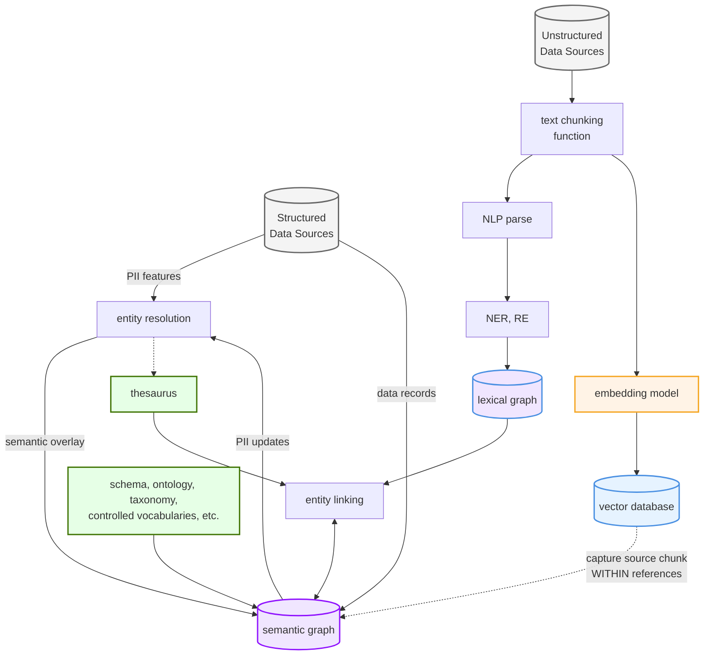
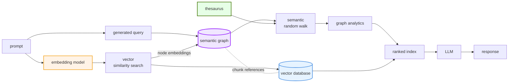

# GraphRAG: Building Knowledge Graphs with Advanced Entity Resolution

## Overview

GraphRAG is a framework for constructing robust knowledge graphs from unstructured and semi-structured data sources. It integrates advanced entity resolution techniques with retrieval-augmented generation to create rich, contextual knowledge representations.

## Acknowledgments

This project builds upon work from the [Connected Data London 2024 Entity Resolved Knowledge Graphs masterclass](https://github.com/DerwenAI/cdl2024_masterclass/blob/main/README.md), with contributions from:

- Paco Nathan (Senzing) - Knowledge Graph Architecture
- Clair Sullivan - Graph Analytics
- Louis Guitton - Entity Resolution
- Jeff Butcher - System Integration
- Michael Dockter - Implementation

## Core Architecture

GraphRAG implements a layered approach to knowledge graph construction:

### Ingestion



### Inference



## Key Components

### 1. Data Ingestion
- BeautifulSoup for web scraping
- Configurable chunking (1024 tokens default)
- Unicode normalization and text cleaning

### 2. Entity Processing
- SpaCy pipeline with GLiNER and GLiREL integration
- Custom NER labels for domain-specific entities
- Relationship extraction with confidence scoring

### 3. Graph Construction
- NetworkX for graph operations
- TextRank-based entity importance scoring
- Semantic overlay abstraction

### 4. Vector Operations
- BAAI/bge-small-en-v1.5 embeddings
- LanceDB for vector storage
- Word2Vec for entity embeddings

### 5. Visualization
- PyVis for interactive graph visualization
- Dynamic node sizing based on entity importance
- Physics-based layout system

## Technical Features

### Entity Types
- Person
- Organization
- Publication
- Technology
- Location
- Event
- Research
- University
- Country
- City

### Relationship Types
- works_at
- developed_by
- authored_by
- headquartered_in
- used_in
- studied_at

### Performance Optimizations
- Chunked processing for large documents
- Efficient entity deduplication
- Memory-aware graph construction

## Installation

1. Environment Setup:
```bash
# Python 3.10+ required
pip install -r requirements.txt
```

2. Start Prefect server:
```bash
prefect server start
```

3. Run the demo:
```bash
python graphrag_demo.py
```

## Implementation Details

The system uses a multi-stage pipeline:

1. **Data Preparation**
   - Text chunking with overlap
   - Unicode normalization
   - Stop word filtering

2. **Entity Extraction**
   - NER with GLiNER
   - Relationship extraction with GLiREL
   - Co-occurrence analysis

3. **Graph Construction**
   - Lexical graph building
   - TextRank scoring
   - Semantic overlay creation

4. **Data Persistence**
   - JSON graph serialization
   - GraphML export
   - Vector database storage

## Advanced Features

### Entity Resolution
- Cross-reference resolution
- Contextual entity linking
- Confidence scoring

### Graph Analytics
- PageRank-inspired entity ranking
- Co-occurrence analysis
- Relationship probability scoring

### Data Quality
- Source attribution
- Confidence metrics
- Entity validation

## Visualization

The system generates an interactive HTML visualization with:
- Color-coded entity types
- Relationship labels
- Size-based entity importance
- Interactive physics simulation

## Future Development

1. Real-time graph updates
2. Enhanced entity resolution
3. Multi-source integration
4. Advanced query capabilities
5. Automated validation workflows

## Contributing

We welcome contributions! Please see our contributing guidelines for details.

## License

This project is licensed under the MIT License - see the LICENSE file for details.

Refer to the source repository for this fork for additional details:  https://github.com/DerwenAI/strwythura