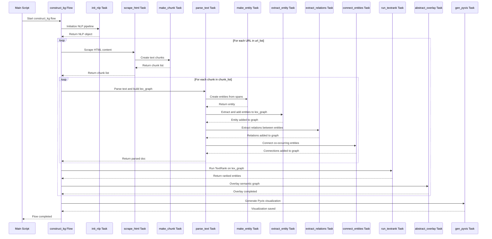
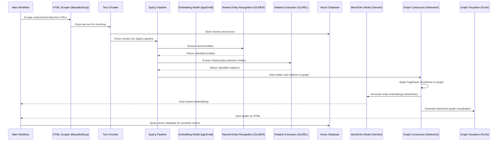
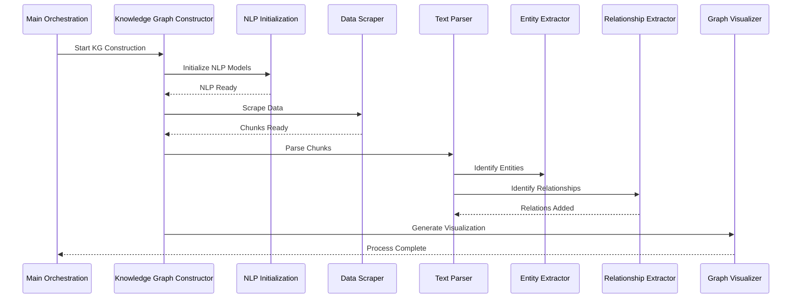
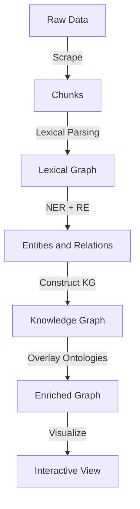

# GraphRAG README

## Citations: giving credit where credit is due...

Inspired by the great work done by multiple individuals who created the [Connected Data London 2024: Entity Resolved Knowledge Graphs](https://github.com/DerwenAI/cdl2024_masterclass/blob/main/README.md) masterclass I created this document to highlight areas that rang true.

- Paco Nathan https://senzing.com/consult-entity-resolution-paco/
- Clair Sullivan https://clairsullivan.com/
- Louis Guitton https://guitton.co/
- Jeff Butcher https://github.com/jbutcher21
- Michael Dockter https://github.com/docktermj

This current repository is a fork of one of four repos that make up the masterclass.
## Some fundamental concepts from the masterclass

### Data Ingestion

- the other aspects that aren't shown on this diagram is the degree to which data has been trusted / validated.
- validated data should often be captured in a structured data store
- fraudulent data may also need to trigger worfklows downstream actions - including flagging data we previously trusted


### Data Ingerence (or applied data use)


## Sequence Diagram

- initial version:  largely based on `demo.py` functions
- what isn't clear based on the code at least is the use of Word2Vec embeddings over and above the other embedding models



## Run the code

1. setup local Python environment and install Python dependencies

   - I used Python 3.11, but 3.10 should work as well

    ```bash
    pip install -r requirements.txt
    ```

2. Start the local Prefect server

   - follow the [self-hosted instructions](https://docs.prefect.io/v3/get-started/quickstart#connect-to-a-prefect-api) to launch the `Prefect UI`

    ```python
    prefect server start
    ```

3. run the `graphrag_demo.py` script

    ```python
    python graphrag_demo.py
    ```

## Graph Visualization based on Master Class content

[View HTML Page](https://github.com/donbr/strwythura/blob/main/graphrag_demo.html)

- NOTE:  you may need to download the file locally to view it.

## Incremental enlightenment...

- some of the following content smells, but there are some emerging nuggets of truth.



### **Explanation of Participants:**

1. **HTML Scraper (BeautifulSoup)**: Fetches unstructured text data from web sources.
2. **Text Chunker**: Breaks raw text into manageable chunks (e.g., 1024 tokens) and prepares them for embedding.
3. **SpaCy Pipeline**: Processes chunks and integrates GLiNER and GLiREL for entity and relation extraction.
4. **Embedding Model (bge-small-en-v1.5)**:
5. **GLiNER**: Identifies domain-specific entities and returns labeled outputs.
6. **GLiREL**: Extracts relationships between identified entities, adding connectivity to the graph.
7. **Vector Database (LanceDB)**: Stores chunk embeddings for efficient querying in downstream tasks.
8. **Word2Vec (Gensim)**: Generates entity embeddings based on graph co-occurrence for additional analysis.
9. **Graph Constructor (NetworkX)**: Builds and analyzes the knowledge graph, ranking entities using TextRank.
10. **Graph Visualizer (PyVis)**: Provides an interactive visualization of the knowledge graph for interpretability.

### **Key Highlights:**

- The diagram separates concerns, showing how the models (GLiNER, GLiREL, and W2V) integrate with components like SpaCy, NetworkX, and LanceDB.
- Each model’s purpose is clearly contextualized within the flow.
- Semantic embeddings (via LanceDB) and graph-specific embeddings (via Word2Vec) are highlighted as complementary processes.

## Building Robust Knowledge Graphs for GraphRAG: A Comprehensive Analysis

### **Executive Overview**
Knowledge Graphs (KGs) are critical in transforming unstructured data into actionable insights, especially for Graph-based Retrieval-Augmented Generation (GraphRAG). This report provides a systematic, layered approach to building robust KGs, leveraging both open-source and proprietary tools to address enterprise-level challenges.

#### **Purpose and Value Proposition**
This workflow stands out by addressing challenges in:

- **Data Ingestion**: Handling noisy and unstructured data.
- **Semantic Enrichment**: Integrating domain-specific ontologies for context.
- **Scalability and Adaptability**: Supporting real-time updates and modularity for diverse use cases.

By blending symbolic reasoning with statistical machine learning, this solution is ideal for regulated environments like healthcare and finance, where auditability and explainability are crucial.

---

### **1. Architectural Workflow: Layered Knowledge Graph Construction**

#### **1.1 Workflow Layers**

1. **Data Ingestion**:
   - **Open Source**: BeautifulSoup for scraping; LanceDB for vector embeddings.
   - **Proprietary**: OpenAI’s `text-embedding-3-small` and Qdrant for advanced vector storage.
2. **Lexical Graph Construction**:
   - Parsing chunks using spaCy.
   - Token ranking with TextRank for key entity identification.
3. **Entity and Relation Extraction**:
   - Named Entity Recognition (NER) with GLiNER.
   - Relation extraction using GLiREL to build connections.
4. **Graph Construction and Visualization**:
   - NetworkX for constructing the graph structure.
   - PyVis for interactive visualizations.
5. **Semantic Overlay**:
   - Integrating structured data and domain-specific ontologies for added context and reasoning.

#### **1.2 Enhanced Sequence Diagram**


---

### **2. Trade-Off Analysis: Open Source vs. Proprietary Solutions**

| **Feature**                     | **Open Source** (GLiNER, LanceDB) | **Proprietary** (OpenAI, Qdrant)        | **Considerations**                       |
|----------------------------------|-----------------------------------|-----------------------------------------|------------------------------------------|
| **Scalability**                  | Modular and scalable              | High scalability with enterprise-grade support | Open Source may require tuning.          |
| **Cost**                         | Minimal                           | Higher licensing costs                  | Depends on budget constraints.           |
| **Model Accuracy**               | Tunable with custom pipelines     | High baseline accuracy                  | Proprietary models excel with limited data. |
| **Auditability**                 | Fully transparent                 | Black-box in some aspects               | Regulated industries may prefer open source. |
| **Integration**                  | Seamless integration with OSS tools | API-driven integration                  | Proprietary APIs may introduce dependencies. |
| **Updates**                      | Requires manual updates           | Auto-updated models                     | Proprietary wins for ease of use.         |

---

### **3. Key Technical Components**

#### **3.1 Data Ingestion and Chunking**
- **Process**: Scrape data using BeautifulSoup; chunk using spaCy.

- **Challenges**: Handling noise, unstructured formats.

- **Solutions**: Introduce configurable pre-processing pipelines.

#### **3.2 NLP Pipeline Initialization**
- **Tools**: spaCy, GLiNER, GLiREL.
- **Key Configurations**: Fine-tune NER and RE models for specific domains.

#### **3.3 Graph Construction**
- **Framework**: NetworkX.
- **Enhancements**: Edge weights based on TextRank scores; customizable traversal algorithms.

#### **3.4 Visualization**
- **Tool**: PyVis for interactive views.
- **Benefit**: Enables real-time exploration and debugging.

---

### **4. Visualized Architecture**

#### **4.1 Logical Data Flow Diagram**


---

### **5. Scalability and Extensibility**

#### **5.1 Incremental Graph Updates**
- **Change Detection**: Monitor for source changes with hash comparisons.

- **Merging**: Ensure conflict resolution during node and edge updates.

#### **5.2 Domain-Specific Support**
- Use domain-specific ontologies (e.g., UMLS for healthcare).

- Fine-tune models using domain-specific datasets.

---

### **6. Conclusion and Next Steps**
This workflow demonstrates how modular, scalable approaches to KG construction can elevate GraphRAG applications in enterprise environments. By addressing real-world challenges with both open-source and proprietary tools, it offers a comprehensive solution for data-driven decision-making.

#### **Next Steps**:

- **Pilot Testing**: Use open-source tools to validate the workflow on real-world datasets.

- **Real-Time Updates**: Research strategies for dynamic graph construction.

- **Domain Expansion**: Fine-tune workflows for sectors like healthcare, finance, and e-commerce.

By leveraging symbolic reasoning and statistical AI, this approach ensures transparency, scalability, and auditability—key requirements for modern enterprises.
