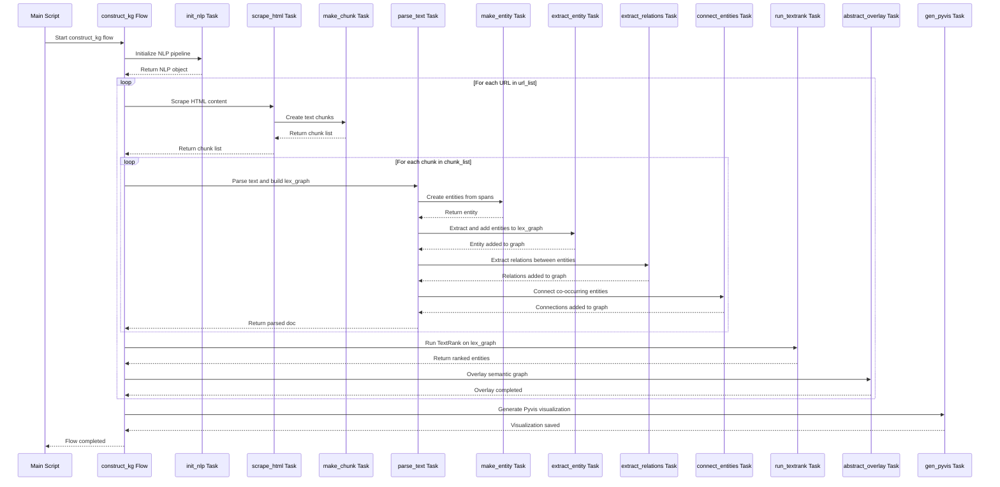

# GraphRAG README

## Citations: giving credit where credit is due...

Inspired by the great work done by multiple individuals who created the [Connected Data London 2024: Entity Resolved Knowledge Graphs](https://github.com/DerwenAI/cdl2024_masterclass/blob/main/README.md) masterclass I created this document to highlight areas that I found .

- Paco Nathan https://senzing.com/consult-entity-resolution-paco/
- Clair Sullivan https://clairsullivan.com/
- Louis Guitton https://guitton.co/
- Jeff Butcher https://github.com/jbutcher21
- Michael Dockter https://github.com/docktermj

This current repository is a fork of one of four repos that make up the masterclass.

## Sequence Diagram



## Run the code

1. setup local Python environment and install Python dependencies

   - I used Python 3.11, but 3.10 should work as well

    ```bash
    pip install -r requirements.txt
    ```

2. Start the local Prefect server

   - follow the [self-hosted instructions](https://docs.prefect.io/v3/get-started/quickstart#connect-to-a-prefect-api) to launch the `Prefect UI`

    ```python
    prefect server start
    ```

3. run the `graphrag_demo.py` script

    ```python
    python graphrag_demo.py
    ```
